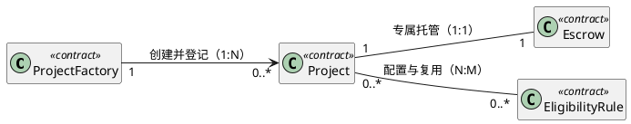

# create-project — 创建项目与托管

## 合约设计

### 合约清单

| 合约 | 简要说明 | 本期变化 |
| --- | --- | --- |
| `ProjectFactory` | 创建并登记项目，完成项目与托管的初始化。 | 新增 |
| `Project` | 管理项目身份、专属托管及参与资格规则。 | 新增 |
| `Escrow` | 为单个项目保管资金，仅接受所属项目的授权指令。 | 新增 |
| `EligibilityRule` | 按固定地址白名单校验资格，供多个项目复用。 | 新增 |

### 合约关系

以下为假设项目的目标设计；实际使用时须替换合约、代码路径与业务规则。节点代表合约类型，基数描述同一部署体系内完成初始化后的实例关联。

工厂可尚未创建项目，每个项目仅归属一个工厂；项目与托管在初始化后双向唯一绑定。项目可暂不配置规则，规则可尚未被引用；多个项目可复用同一规则实例。规则关系表示项目保存的地址集合，不表示继承或数据库外键。

## 数据模型

- 结构变更：无

本期不涉及数据模型变更，沿用现有实现。

## 功能时序图

- 时序图：不生成

示例使用 Solidity。工厂的 createProject() 创建 Project 和 Escrow，以调用者为项目管理者，完成一次性互相绑定后才登记项目并返回两个地址；任一步失败则整笔交易回滚。项目的 factory、manager 和 escrow 在初始化后不可替换，托管的所属项目不可替换；绑定入口仅工厂可调用一次。Escrow 的资金操作只接受所属 Project 调用，Project 仅允许管理者发起；调用方传入的任意项目地址不能替代该绑定。

## 接口设计

本期不涉及接口变更，沿用现有实现。

## 代码改造点

- `contracts/ProjectFactory.sol`，`createProject`（新增）：创建并初始化项目及托管，登记成功创建的项目。
- `contracts/Project.sol`，`initializeEscrow`（新增）：保存工厂与管理者身份，完成受限的一次性托管绑定。
- `contracts/Escrow.sol`，`constructor`（新增）：绑定唯一所属项目并限制资金操作的调用者。
