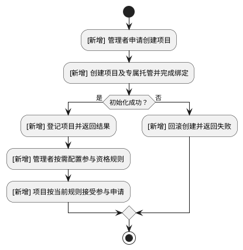

# 项目合约与专属资金托管

- 业务流程变化：有
- 判定依据：假设项目新增从创建到配置参与资格的流程；实际计划须核对需求与代码后替换本例事实。

## 背景

- User Story：作为项目管理者，我希望创建具有专属资金托管的项目，以便独立管理本项目资金。
- User Story：作为项目管理者，我希望为项目配置可复用的参与资格规则，以便控制参与范围。

## 业务流程总览

### 项目创建与资格配置流程

