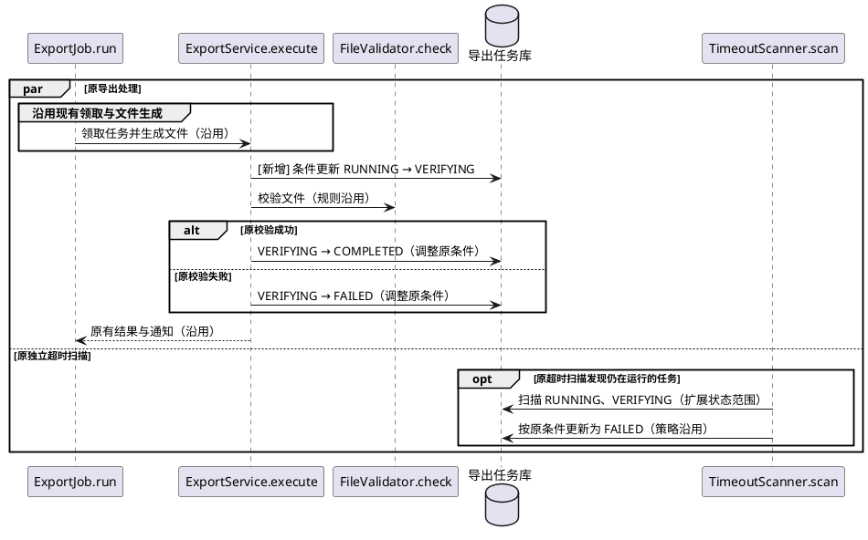

# mark-verifying — 标记校验阶段

## 数据模型

- 结构变更：无

本期不涉及数据模型变更，沿用现有实现。

示例中的 export_tasks.phase 为无数据库枚举或 CHECK 约束的字符串字段，VERIFYING 仅新增业务值，无 SQL 调整；实际项目必须核对字段约束，不能照搬此结论。

## 功能时序图

- 时序图：生成

仅增加内部校验阶段。示例假设现有接口只返回任务标识或最终文件地址，不暴露内部 phase，所以接口契约不变。沿用 ExportJob 的领取/生成、FileValidator 的校验规则、原结果通知和 FAILED 重试入口，不展开其内部调用。

进入校验前条件更新 RUNNING → VERIFYING，成功/失败落库条件随之调整；沿用原独立状态更新事务和并发保护，未命中条件时按原规则退出，不把文件生成或校验包入新事务。原超时扫描独立运行，范围须包含 VERIFYING，处理策略不变。

## 接口设计

本期不涉及接口变更，沿用现有实现。

## 代码改造点

- `src/ExportPhase.java`，`VERIFYING`（新增）：增加内部校验中状态值。
- `src/ExportService.java`，`execute`：在调用既有校验前记录 VERIFYING，完成条件改为匹配该状态。
- `src/TimeoutScanner.java`，`scan`：把 VERIFYING 纳入原运行中超时处理范围。
- `tests/ExportServiceTest.java`：补充新增状态、成功/失败衔接与超时联动测试，保留原校验用例。
