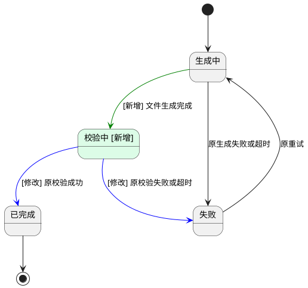

# 导出任务增加校验中状态

- 业务流程变化：无
- 判定依据：示例已存在领取、生成、校验、完成/失败及超时处理；本期仅用 VERIFYING 表达既有校验阶段，业务阶段和路径不变，状态机仍须更新。依据 ExportService.execute、FileValidator.check、TimeoutScanner.scan 核实，实际项目须替换示例事实。

## 背景

- User Story：作为运维人员，我希望区分导出任务正在生成还是校验文件，以便定位处理卡点。

## 状态机

### 导出任务状态机

