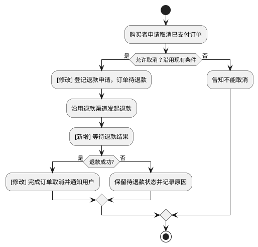
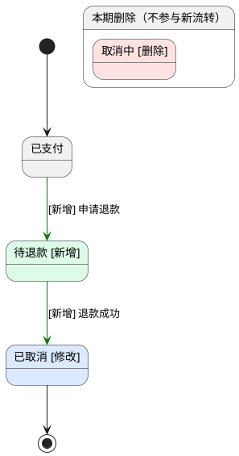

# 订单取消支持退款确认

- 业务流程变化：有
- 判定依据：示例中取消完成由申请后立即完成改为等待退款结果确认，改变业务阶段顺序与完成时点；实际计划须以流程索引和代码核实。

## 背景

- User Story：作为购买者，我希望取消已支付订单后看到退款处理中，以便知道退款尚未完成。
- User Story：作为购买者，我希望退款成功后再看到订单已取消，以便确认交易已经结束。

## 业务流程总览

### 订单取消与退款确认流程

## 状态机

### 订单状态机

