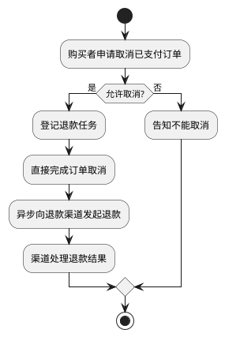
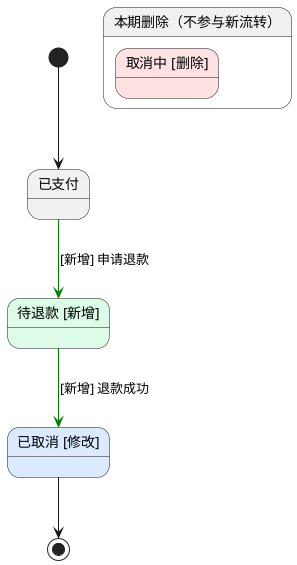

# 订单取消支持退款确认

- 业务流程变化：有
- 判定依据：示例中取消完成由申请后立即完成改为等待退款结果确认，改变业务阶段顺序与完成时点；实际计划须以流程索引和代码核实。

## 背景

- User Story：作为购买者，我希望取消已支付订单后看到退款处理中，以便知道退款尚未完成。
- User Story：作为购买者，我希望退款成功后再看到订单已取消，以便确认交易已经结束。

## 业务流程总览

以下为示例当前流程。实际计划先参考相关 `.keel/call-chain/` 索引，再核对 OrderService.cancel、退款任务和测试，并在此简述已核实的证据路径。

## 状态机

绿色为新增，蓝色为修改，红色区域仅记录本期删除，不参与新流转。原 PAID → CANCELLING → CANCELLED 改为等待退款成功后取消。

