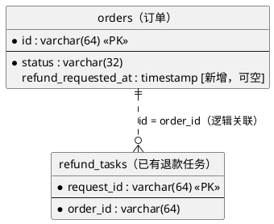
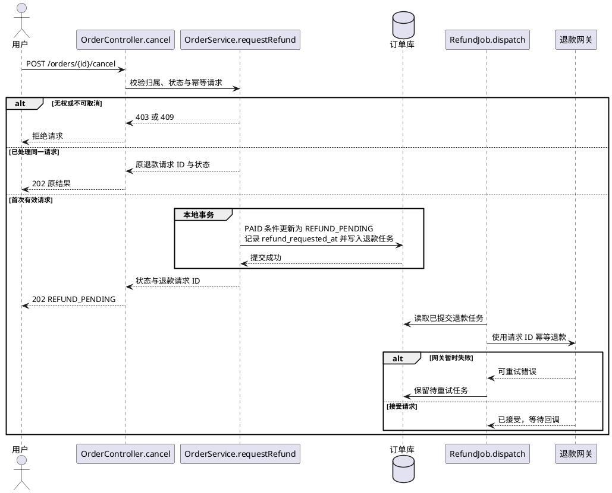

# cancel-order — 发起取消

## 数据模型

- 结构变更：新增字段

orders 新增可空 refund_requested_at，表示首次申请退款的时间；旧订单保留 NULL，不回填。以下为 PostgreSQL 示例，实际计划须替换为项目数据库方言及迁移约定。status 为已有文本字段，增加 REFUND_PENDING 业务值不修改列类型。



仅列本次相关字段，其他既有字段省略；request_id 沿用现有唯一主键，不新增数据库外键。

```sql
ALTER TABLE orders ADD COLUMN refund_requested_at TIMESTAMP NULL;
```

先执行字段迁移再上线应用。恢复旧应用时保留新增列和已写数据；确认在途退款处理完成后再评估清理，不自动删除列。

## 功能时序图

- 时序图：生成

实现约定：沿用现有可靠任务和退款通道。订单状态、申请时间与退款任务同事务提交；重复请求复用原退款请求 ID，渠道暂时失败时继续使用该 ID 重试。新状态上线前先完成字段迁移与客户端适配。



## 接口设计

### POST `/orders/{id}/cancel`

入参沿用：路径 id（String），请求头 Idempotency-Key（String），无请求体。

失败响应：无权操作返回 403，不满足取消条件返回 409。

出参（202，仅列变更）：

| 字段 | 类型 | 变更 |
| --- | --- | --- |
| status | String | 修改：新增枚举 REFUND_PENDING |
| refundRequestId | String | 新增：退款请求 ID |

响应 JSON（变更字段示例）：

```json
{"status": "REFUND_PENDING", "refundRequestId": "refund-123"}
```

## 代码改造点

- `src/main/java/example/OrderService.java`，`cancel` / `requestRefund`（新增）：将直接取消改为事务内记录待退款、申请时间及退款任务。
- `src/main/java/example/Order.java`，`refundRequestedAt`（新增）：映射退款申请时间字段。
- `src/main/resources/db/migration/V42__refund_requested_at.sql`（新增）：增加订单退款申请时间列。
