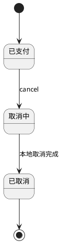
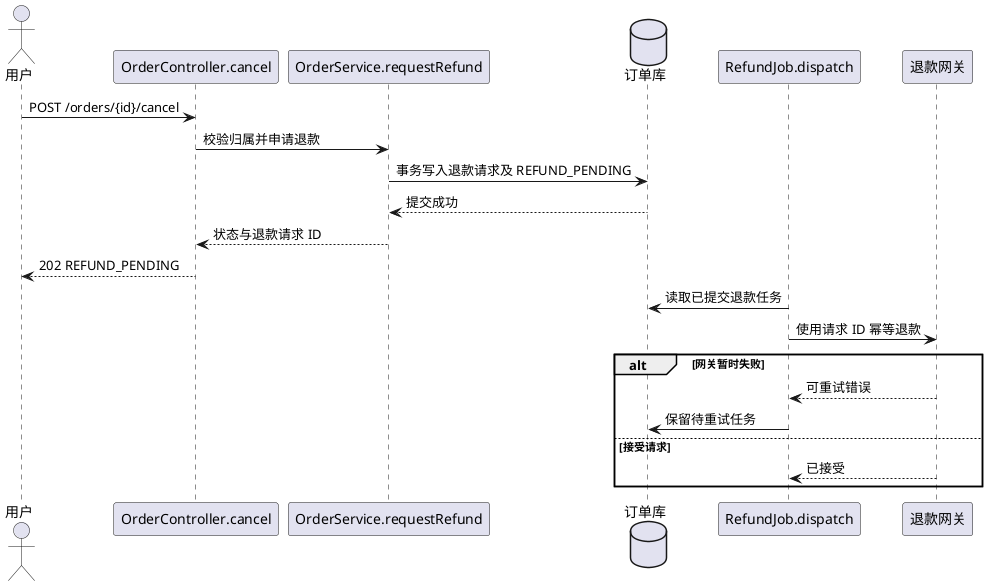
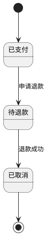
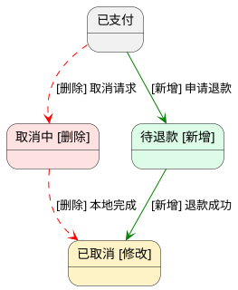

# 订单取消支持退款确认

## 背景与范围

本模板以 Java/Maven 订单服务为具体示例，不要求目标项目使用该语言、工具或分层。生成实际计划时替换为项目已核对的语言、模块/函数或类/方法、路径和验证命令；无类语言不必创建类。取消已支付订单需要等待退款成功。本次包含退款请求和退款回调；不包含支付渠道替换。依赖：退款网关 `ready`，沿用现有通道。

## 现有业务流程与状态机

用户请求经 `OrderController.cancel` 到 `OrderService.cancel`，当前经取消中状态完成取消，但未等待退款确认。依据：`src/main/java/example/OrderService.java` 和订单取消测试（示例路径，实际计划必须核对）。

| 源状态 | 目标状态 | 触发/条件 | 业务入口 | 状态变更符号 |
| --- | --- | --- | --- | --- |
| PAID | CANCELLING | 取消订单 | OrderController.cancel | OrderService.cancel |
| CANCELLING | CANCELLED | 本地取消完成 | OrderController.cancel | OrderService.cancel |

## 本次功能目标

### cancel-order — 发起取消

- 目标：已支付订单发起退款，等待退款确认后取消。
- 时序图：生成
- 目标流程：校验归属和状态；持久化退款请求与待退款状态；提交后由现有可靠任务投递退款请求；网关暂时失败时安全重试。
- 验收标准：已支付订单首次取消返回 REFUND_PENDING 和退款请求 ID；同一请求重复提交返回同一 ID，不重复发起退款；无权操作返回 403。

### confirm-refund — 确认退款

- 目标：收到退款成功回调后完成取消。
- 时序图：不生成
- 目标流程：验签并匹配退款请求；退款成功时将待退款订单置为已取消；重复成功回调返回成功但不重复通知，失败回调保持待退款并记录失败原因。
- 验收标准：有效成功回调将 REFUND_PENDING 改为 CANCELLED 并仅通知一次；验签失败返回 401 且不修改订单；重复回调不重复副作用。

## 功能时序图

### cancel-order — 发起取消

## 状态机调整

### 目标状态图

### 本期差异图

绿色 [新增]、黄色 [修改]、红色 [删除]；本期删除取消中状态及原取消流转，以待退款替代。差异图是比较视图，不代表目标可执行流转。

| 功能 | 源状态 → 目标状态 | 事件/条件 | 本期变化 | 业务入口符号 | 状态变更符号 |
| --- | --- | --- | --- | --- | --- |
| cancel-order | PAID → CANCELLING → CANCELLED | 取消请求、本地完成 | 删除旧状态及两条边 | OrderController.cancel | OrderService.cancel（移除旧流转） |
| cancel-order | PAID → REFUND_PENDING | 校验通过且退款任务入库 | 新增 | OrderController.cancel | OrderService.requestRefund（新增） |
| confirm-refund | REFUND_PENDING → CANCELLED | 验签且退款成功 | 新增流转，修改 CANCELLED 到达条件 | RefundController.callback | OrderService.confirmRefund（新增） |

## 接口设计

| 功能 | 接口 | 入参 | 出参/错误 | 兼容要求 |
| --- | --- | --- | --- | --- |
| cancel-order | POST /orders/{id}/cancel | orderId；Idempotency-Key | 202，status、refundRequestId；403 无权；409 不可取消 | 客户端支持待退款响应 |
| confirm-refund | POST /refunds/callback | requestId、结果、签名 | 200 已处理或重复；401 验签失败 | 沿用渠道签名规则 |

订单 status 新增 REFUND_PENDING；沿用既有退款任务表，requestId 唯一。无新表迁移。

## 代码改造点

| 功能 | 文件 | 模块/符号 | 当前职责 | 改造内容 |
| --- | --- | --- | --- | --- |
| cancel-order | src/main/java/example/OrderController.java | OrderController.cancel | 同步取消 | 返回待退款响应 |
| cancel-order | src/main/java/example/OrderService.java | OrderService.requestRefund（新增） | cancel 直接修改状态 | 事务写入待退款和退款任务，移除直接取消 |
| cancel-order | src/main/java/example/RefundJob.java | RefundJob.dispatch | 投递退款任务 | 沿用任务机制与请求 ID 幂等 |
| confirm-refund | src/main/java/example/RefundController.java | RefundController.callback | 处理渠道回调 | 路由订单退款结果 |
| confirm-refund | src/main/java/example/OrderService.java | OrderService.confirmRefund（新增） | 无 | 条件更新订单，重复回调不重复通知 |

## 技术决策与约束

沿用现有事务、可靠任务和渠道 SDK，不引入新框架。订单状态与退款任务同事务提交；回调使用条件更新和通知去重。项目依据在实际计划中列出已核对路径。

## 实施顺序

1. cancel-order：增加状态和事务内退款任务，运行取消与重复请求测试。
2. confirm-refund：接入验签及条件更新，运行回调、异常和重复通知测试。

## 验证方案

工作目录：项目根。命令：`mvn -Dtest=OrderCancellationTest,RefundCallbackTest test`（仅为 Java/Maven 示例，实际计划需核对工具链、命令和测试名）。验证两个功能的正常、无权、网关重试、失败回调、重复回调和副作用；等待退款期间不得提前进入 CANCELLED。

## 风险与恢复

新增状态使旧代码不能处理待退款订单。回滚前停止新取消入口，完成或人工核对在途退款；确认 REFUND_PENDING 无积压后再回滚。不能把未完成退款的订单直接改为 CANCELLED；恢复后验证订单金额、退款流水及通知无重复。
