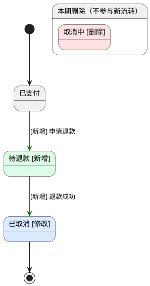
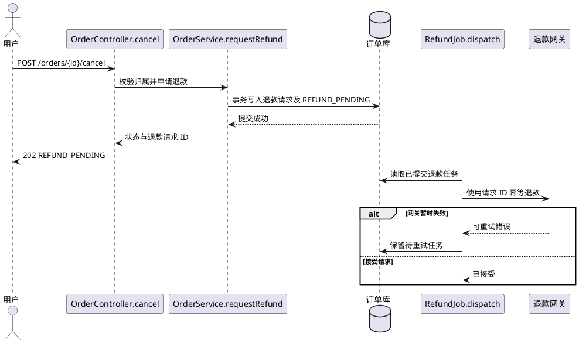

# 订单取消支持退款确认

## 背景与范围

取消已支付订单需要等待退款成功。本次包含退款请求和退款回调；不包含支付渠道替换。依赖：退款网关 `ready`，沿用现有通道。

## 本次功能目标

### cancel-order — 发起取消

- 目标：已支付订单发起退款，等待退款确认后取消。
- 验收标准：已支付订单首次取消返回 REFUND_PENDING 和退款请求 ID；同一请求重复提交返回同一 ID，不重复发起退款；无权操作返回 403。

### confirm-refund — 确认退款

- 目标：收到退款成功回调后完成取消。
- 验收标准：有效成功回调将 REFUND_PENDING 改为 CANCELLED 并仅通知一次；验签失败返回 401 且不修改订单；重复回调不重复副作用。

## 状态机

绿色为新增，蓝色为修改，红色区域仅记录本期删除，不参与新流转。


```plantuml
@startuml
state "已支付" as PAID
state "待退款 [新增]" as REFUND_PENDING #DCFCE7
state "已取消 [修改]" as CANCELLED #DBEAFE
[*] --> PAID
PAID -[#green]-> REFUND_PENDING : [新增] 申请退款
REFUND_PENDING -[#green]-> CANCELLED : [新增] 退款成功
CANCELLED --> [*]
state "本期删除（不参与新流转）" as REMOVED {
  state "取消中 [删除]" as CANCELLING #FEE2E2
}
@enduml
```

## 功能时序图

- cancel-order：生成
- confirm-refund：不生成

### cancel-order — 发起取消


```plantuml
@startuml
actor 用户
participant "OrderController.cancel" as API
participant "OrderService.requestRefund" as Service
database 订单库 as DB
participant "RefundJob.dispatch" as Job
participant 退款网关 as Gateway
用户 -> API : POST /orders/{id}/cancel
API -> Service : 校验归属并申请退款
Service -> DB : 事务写入退款请求及 REFUND_PENDING
DB --> Service : 提交成功
Service --> API : 状态与退款请求 ID
API --> 用户 : 202 REFUND_PENDING
Job -> DB : 读取已提交退款任务
Job -> Gateway : 使用请求 ID 幂等退款
alt 网关暂时失败
Gateway --> Job : 可重试错误
Job -> DB : 保留待重试任务
else 接受请求
Gateway --> Job : 已接受
end
@enduml
```

## 接口设计

### cancel-order — 发起取消

POST `/orders/{id}/cancel`

入参沿用：路径 `id`（String），请求头 `Idempotency-Key`（String），无请求体。

出参（202，仅列变更）：

| 字段 | 类型 | 变更 |
| --- | --- | --- |
| status | String | 修改：新增枚举 REFUND_PENDING |
| refundRequestId | String | 新增：退款请求 ID |

响应 JSON（变更字段示例）：

```json
{"status": "REFUND_PENDING", "refundRequestId": "refund-123"}
```

### confirm-refund — 确认退款

POST `/refunds/callback`

入参：

| 字段 | 类型 | 必填 | 说明 |
| --- | --- | --- | --- |
| requestId | String | 是 | 退款请求 ID |
| result | String | 是 | SUCCESS / FAILED |
| signature | String | 是 | 签名 |

出参：200，无响应体。

请求 JSON：

```json
{"requestId": "refund-123", "result": "SUCCESS", "signature": "example-signature"}
```

## 代码改造点

`src/main/java/example/OrderService.java`：

- cancel-order：调整 `cancel`，新增 `requestRefund`，事务写入待退款和退款任务，移除直接取消。
- confirm-refund：新增 `confirmRefund`，退款确认后条件更新订单，重复回调不重复通知。

## 技术决策与约束

示例使用 Java/Maven；实际计划按已核对的项目语言、符号和工具链替换。

现状依据：CallChain 订单取消索引、`src/main/java/example/OrderService.java` 和取消测试（示例，实际计划须核对）。原取消流程未等待退款确认。

沿用现有事务、可靠任务和渠道 SDK，不引入新框架。订单状态与退款任务同事务提交；回调使用条件更新和通知去重。项目依据在实际计划中列出已核对路径。

取消入口校验归属与状态，无权返回 403、不可取消返回 409；客户端支持待退款响应。回调沿用渠道签名，验签失败返回 401；失败回调保持待退款并记录原因。网关暂时失败由可靠任务重试，重复回调不重复通知。订单 status 增加 REFUND_PENDING；沿用退款任务表，requestId 唯一，无新表迁移。

| 功能 | 源状态 → 目标状态 | 事件/条件 | 本期变化 | 业务入口符号 | 状态变更符号 |
| --- | --- | --- | --- | --- | --- |
| cancel-order | PAID → CANCELLING → CANCELLED | 取消请求、本地完成 | 删除旧状态及两条边 | OrderController.cancel | OrderService.cancel（移除旧流转） |
| cancel-order | PAID → REFUND_PENDING | 校验通过且退款任务入库 | 新增 | OrderController.cancel | OrderService.requestRefund（新增） |
| confirm-refund | REFUND_PENDING → CANCELLED | 验签且退款成功 | 新增流转，修改 CANCELLED 到达条件 | RefundController.callback | OrderService.confirmRefund（新增） |

## 实施顺序

1. cancel-order：增加状态和事务内退款任务，运行取消与重复请求测试。
2. confirm-refund：接入验签及条件更新，运行回调、异常和重复通知测试。

## 验证方案

工作目录：项目根。命令：`mvn -Dtest=OrderCancellationTest,RefundCallbackTest test`（仅为 Java/Maven 示例，实际计划需核对工具链、命令和测试名）。验证两个功能的正常、无权、网关重试、失败回调、重复回调和副作用；等待退款期间不得提前进入 CANCELLED。

## 风险与恢复

新增状态使旧代码不能处理待退款订单。回滚前停止新取消入口，完成或人工核对在途退款；确认 REFUND_PENDING 无积压后再回滚。不能把未完成退款的订单直接改为 CANCELLED；恢复后验证订单金额、退款流水及通知无重复。
