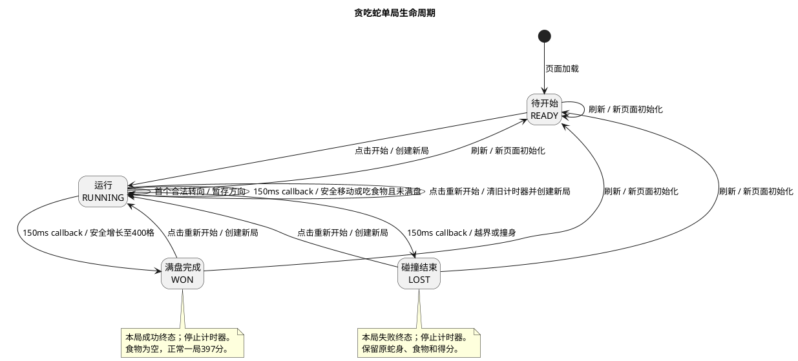

# 贪吃蛇单局游戏流程

## 业务目标与边界

玩家开始一局，通过转向和定时移动吃食物、增长并计分，直到碰撞失败或占满棋盘完成；可重新开始一局。状态只存于页面内存，刷新后回到待开始，不保存历史成绩。

本文路径相对于父 Git 仓库根目录，故均带 `keel-test/` 前缀。页面由静态服务加载，无 HTTP/RPC 业务接口、MQ 或后端任务；持续推进来自浏览器定时 callback。

## 业务步骤

1. 页面模块初始化 `READY`：20×20 棋盘，蛇从 `(10,10)`、`(9,10)`、`(8,10)` 开始，方向向右，分数 0，无待应用方向，食物从空格中随机选取；尚不运行计时器。
2. 玩家点击开始，创建新的 `RUNNING` 状态并绘制。运行或结束后点击重新开始也创建新局：先清除旧计时器，恢复初始蛇、方向和分数，再建立一个 150 毫秒计时器。
3. 运行中接收方向键或不区分大小写的 WASD。忽略长按重复事件；每步只接受第一个与当前方向垂直的请求，暂存到 `pendingDirection`。同向、反向及无效请求不消耗本步机会，已有待应用方向时后续请求均忽略。
4. 定时 callback 推进一步，应用待转方向并计算新蛇头。越界或进入仍被占据的身体格则进入 `LOST`，保留原蛇身、食物和得分，清空待转方向；未吃食物时允许进入本步移走的尾格。
5. 无碰撞则移动；未吃食物时移走尾格，分数和食物不变；吃食物时保留尾格、分数加 1，未满盘则从空格重新生成食物并继续运行。蛇占满 400 格时进入 `WON`，食物置空，正常一局得分为 397。
6. 每步同步棋盘、分数和状态；进入 `LOST` 或 `WON` 后清除计时器并显示本局结果。结束状态不再接受转向或推进；重新开始创建新局，不恢复旧局。刷新页面重新初始化为 `READY`。

## 入口目录

| 步骤 | 触发类型 | 仓库相对路径 | 入口符号 | 说明 |
| --- | --- | --- | --- | --- |
| 加载或刷新 | 浏览器 module 初始化 | `keel-test/index.html:10`、`keel-test/app.mjs:16` | `app.mjs` 模块顶层 `state = createGame()` | 建立待开始状态；顶层 `render()` 绘制，不建立计时器 |
| 开始 | DOM `click` callback | `keel-test/app.mjs:81` | `startGame`（绑定 `#start`） | 按钮仅在 `READY` 可用；创建运行新局 |
| 重新开始 | DOM `click` callback | `keel-test/app.mjs:82` | `startGame`（绑定 `#restart`） | 按钮在 `RUNNING`、`LOST`、`WON` 可用；清除旧计时器并创建新局 |
| 转向请求 | DOM `keydown` callback | `keel-test/app.mjs:75` | `document.addEventListener('keydown', ...)` 匿名监听器 | 仅处理运行中的已识别方向键；非重复事件交给规则函数 |
| 自动推进 | 异步浏览器定时 callback | `keel-test/app.mjs:68` | `startGame` 内 `window.setInterval` 匿名回调 | 每 150 毫秒推进、绘制；终态清除计时器 |

## 当前业务状态机

状态字段为 `state.status`；状态文本定义于 `keel-test/app.mjs:14`，规则状态由 `keel-test/game.mjs` 返回，页面层接收并替换 `state`。

| 名称／值 | 含义 | 初态／终态 |
| --- | --- | --- |
| `READY` | 页面已准备，等待玩家开始，不移动 | 页面初态 |
| `RUNNING` | 本局运行，可接收转向并由定时 callback 推进 | 活动状态 |
| `LOST` | 下一步将撞墙或撞身，显示游戏结束与本局得分 | 本局失败终态 |
| `WON` | 蛇占满棋盘，显示完成与本局得分，无食物 | 本局成功终态 |

`direction`、`pendingDirection`、`snake`、`food`、`score` 是本局运行数据，不另立业务阶段。终态允许通过重新开始创建另一局；这不恢复已结束的那一局。

## 状态流转与执行证据

表中的规则函数返回新状态，实际页面状态替换分别发生在模块顶层、键盘 callback 或定时 callback；未将普通内部调用拆成业务节点。

| 源 → 目标 | 触发事件 | 前置条件与结果 | 业务入口符号 | 实际执行状态变化的符号与证据路径 |
| --- | --- | --- | --- | --- |
| 未加载 → `READY`；任意状态 → 新页面 `READY` | 页面加载或刷新 | 新页面重新建立初始蛇、方向、食物及零分，不启动移动 | `app.mjs` 模块顶层 | `createGame`：`keel-test/game.mjs:21`；页面赋值 `keel-test/app.mjs:16` |
| `READY` → `RUNNING` | `#start` 的 `click` callback | 页面通过 `render` 仅在 `READY` 启用开始按钮；清旧计时器，创建新局并建立 150ms 计时器 | `startGame`，绑定见 `keel-test/app.mjs:81` | `startGame` 接收 `createGame('RUNNING')`：`keel-test/app.mjs:64`；`createGame`：`keel-test/game.mjs:21`；按钮条件 `keel-test/app.mjs:52` |
| `RUNNING`／`LOST`／`WON` → 新局 `RUNNING` | `#restart` 的 `click` callback | 重开按钮在非 `READY` 可用；旧计时器先清除，蛇长重置 3、朝右、零分、待转方向清空，食物重选 | `startGame`，绑定见 `keel-test/app.mjs:82` | `startGame`：`keel-test/app.mjs:64`；`clearTimer`：`keel-test/app.mjs:59`；`createGame`：`keel-test/game.mjs:21`；按钮条件 `keel-test/app.mjs:53` |
| `RUNNING` → `RUNNING` | `keydown` callback | 方向键或 WASD，非重复事件，无待转方向，且请求与当前方向垂直；只更新 `pendingDirection` | `document.addEventListener('keydown', ...)` 匿名监听器 | `requestTurn`：`keel-test/game.mjs:29`；页面赋值 `keel-test/app.mjs:79` |
| `RUNNING` → `RUNNING` | **异步** 150ms 定时 callback | 应用待转方向；新头未越界、未撞仍占用的身体，且未吃食物；加入新头并移走尾格，分数及食物不变，待转方向清空 | `startGame` 内 `window.setInterval` 匿名回调 | `step`：`keel-test/game.mjs:37`（碰撞范围 44 行、移动 49–55 行）；页面赋值 `keel-test/app.mjs:69` |
| `RUNNING` → `RUNNING` | **异步** 150ms 定时 callback | 安全进入食物格且增长后未满 400 格；保留尾格，分数加 1，新食物来自空格，待转方向清空 | 同上，`keel-test/app.mjs:68` | `step`：`keel-test/game.mjs:37`（49–55 行）；页面赋值 `keel-test/app.mjs:69` |
| `RUNNING` → `LOST` | **异步** 150ms 定时 callback | 新头越界或撞到仍占用的身体格；未吃食物时忽略旧尾格。保留原蛇身、食物、得分，记录本步方向并清空待转方向 | 同上，`keel-test/app.mjs:68` | `step` 碰撞分支：`keel-test/game.mjs:43`；页面赋值并绘制：`keel-test/app.mjs:69`；终态清理：`keel-test/app.mjs:71`、`clearTimer`（59 行） |
| `RUNNING` → `WON` | **异步** 150ms 定时 callback | 安全移动后蛇长等于 400；正常流程为吃最后一颗食物，分数加 1 至 397，食物置空，不再随机选食物 | 同上，`keel-test/app.mjs:68` | `step` 满盘分支：`keel-test/game.mjs:51`；页面赋值并绘制：`keel-test/app.mjs:69`；终态清理：`keel-test/app.mjs:71`、`clearTimer`（59 行） |

无变化条件：`READY`、`LOST`、`WON` 下规则推进与转向原样返回（`keel-test/game.mjs:30`、38 行）；运行中同向／反向／无效方向、已有待转方向的请求也不修改状态（29–34 行）；键盘长按重复事件不进入规则转向（`keel-test/app.mjs:79`）。

## 失败、重开与终态

- 业务失败仅指碰撞产生 `LOST`；满盘为成功终态 `WON`。终态展示和按钮可用性由 `render`（`keel-test/app.mjs:49`）根据状态更新。
- 页面使用 `clearTimer` 清理终态或重开时的旧定时器；每次 `startGame` 只建立一个新计时器，不累计移动速度。
- 无自动重试、补偿、持久化恢复或异常恢复状态。重新开始是玩家发起的新局，刷新则创建新的待开始页面；代码没有后端事务、消息消费或服务端 Scheduler。

## 现有验证定位

`keel-test/tests/game.test.mjs` 覆盖初始状态、输入门禁、移动增长、四面撞墙、撞身、移走尾格、满盘无食物、非运行态停止及重开初始值。计时器和真实页面操作的已有验证记录见 `keel-test/README.md`；本索引维护不替代 QA，不宣称在本任务中重跑浏览器验收。
